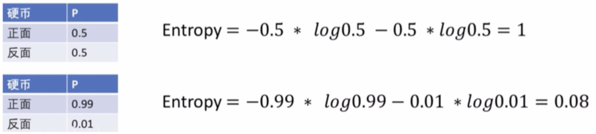
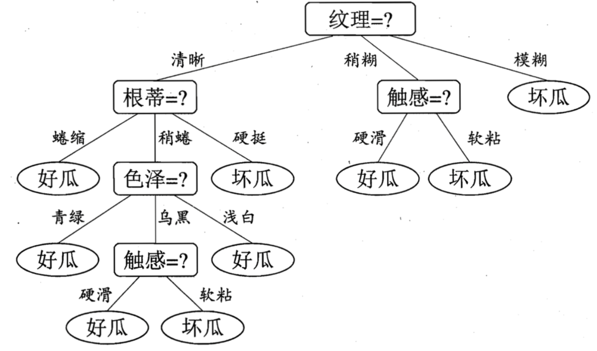
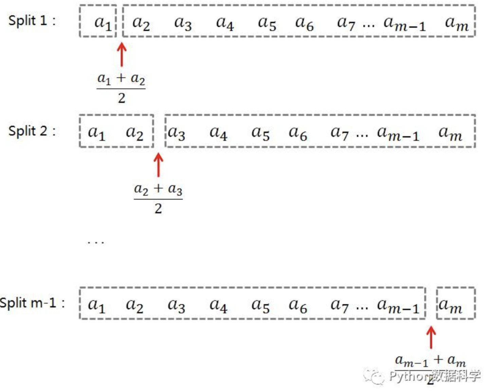
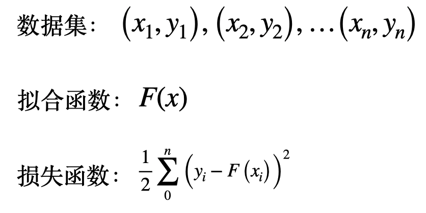

# Tree Models

[TOC]

## Background
The core idea of tree models is "if.. else ..". Complex tree models are combinations of many decision trees in different ways. Here I'll explain step by step from basics to advanced, covering various tree model variants, which also serves as a review of my own knowledge.

## Decision Tree

A decision tree makes if-else judgments on features. For example, classifying balls: suppose we're in a dark environment where we can't see the ball colors. We only know their size and surface texture through touch, and need to predict and classify colors based on these features. If we choose to classify by size - size > 1 goes to one class, size < 1 goes to another. The result looks like the diagram below - not perfect.

But we can see the balls are roughly separated. How do we judge whether the classification is good or bad? How do we choose the threshold for features? That's what we'll discuss next.

## Information Entropy

Information entropy can be used to judge the quality of classification results. The n summation represents n possible situations, each with its probability.
$H(X) = - \sum_{i=1}^{n} P(X=i) \log_2 P(X=i)$

Below is a coin toss example showing how information entropy is calculated. Greater uncertainty means higher entropy; less uncertainty means lower entropy.

Now with information entropy as a metric, we can quantify the ball classification results. But for precise expression, we need conditional entropy and information gain.

#### Conditional Entropy

Conditional entropy is defined as the uncertainty of random variable X given random variable Y.
Intuitive understanding: entropy under a given condition, analogous to conditional probability.
$H(X|Y=y) = - \sum_{i=1}^{n} P(X=i|Y=y)\log_2 P(X=i|Y=y)$

#### Information Gain

Information gain measures how much uncertainty decreases after adding a condition.
Also understood as: the degree of entropy reduction after adding a condition.
$I(X,Y) = H(X) - H(X|Y)$

#### Example
Let's use these three concepts for the ball classification example.

First, information entropy: $H(X) = - (0.5 \log_2 0.5 + 0.5 \log_2 0.5) = 1 $

Then **conditional entropy**:

##### Left subtree: size > 1
- Samples: 40 red balls, 15 blue balls
- Total: 55

Probabilities:

$
P(\text{red} \mid \text{size}>1) = \frac{40}{55}, \quad P(\text{blue} \mid \text{size}>1) = \frac{15}{55}
$

Conditional entropy formula:

$
H(X \mid \text{size}>1) = - \left( \frac{40}{55} \log_2 \frac{40}{55} + \frac{15}{55} \log_2 \frac{15}{55} \right)
$

Result approximately:

$
H(X \mid \text{size}>1) \approx 0.86 \text{ bit}
$

##### Right subtree: size ≤ 1
- Samples: 10 red balls, 35 blue balls
- Total: 45

Probabilities:

$
P(\text{red} \mid \text{size} \le 1) = \frac{10}{45}, \quad P(\text{blue} \mid \text{size} \le 1) = \frac{35}{45}
$

Conditional entropy formula:

$
H(X \mid \text{size} \le 1) = - \left( \frac{10}{45} \log_2 \frac{10}{45} + \frac{35}{45} \log_2 \frac{35}{45} \right)
$

Result approximately:

$
H(X \mid \text{size} \le 1) \approx 0.79
$

##### Conditional entropy given feature size \(H(X \mid \text{size})\)

Weighted sum:

$
H(X \mid \text{size}) = \frac{55}{100} \cdot 0.86 + \frac{45}{100} \cdot 0.79 \approx 0.83 \text{ bit}
$

##### Information gain \(I(X, \text{size})\)

$
I(X, \text{size}) = H(X) - H(X \mid \text{size}) = 1 - 0.83 \approx 0.17
$

Thus, decision trees can use information gain as a criterion, then use optimization algorithms to find the optimal tree across features. Trees can be classification trees or regression trees - the difference is whether leaf nodes contain categories or numerical values.

## ID3 Algorithm

Using an example from the classic ML book: the root node dataset has 8 good watermelons and 9 bad watermelons, with entropy 0.998.

Then select the first feature: calculate information gain for different features. E.g., first feature is color, information gain is 0.109, i.e., Gain(D, color)=0.109. Similarly, when choosing other features as the first feature:

**Feature selection logic: choose the feature with maximum information gain!** Thus, the first layer uses texture as its feature.

Next, calculate information gain for each child node, e.g., for texture=clear node, then select the maximum.

Continuing this process, we get this tree:

#### Limitations
This method only works for discrete features (like texture being smooth or rough), but cannot handle continuous values like 0-1. Also, building trees this way leads to overfitting.

## C4.5

To address the feature count bias in information gain, C4.5 uses gain ratio instead of information gain as the criterion for optimal feature selection.

$
\text{GainRatio}(D, A)=\frac{\text{Gain}(D, A)}
{
-\sum_{i=1}^{n}
\frac{|D_i|}{|D|}
\log_2
\left(
\frac{|D_i|}{|D|}
\right)
}
$

Where:
- \(D\): current dataset
- \(A\): current splitting feature
- \(D_i\): i-th subset after splitting by feature \(A\)
- \(|D_i|\): subset sample count
- \(|D|\): original dataset sample count
- \(\text{Gain}(D, A)\): information gain

For continuous features, this algorithm uses binary discretization: sort continuous features, create N-1 binary splits for N continuous values, calculate information gain for each split, and select the best.

#### Summary
C4.5 uses gain ratio to solve ID3's bias toward features with many values, and handles continuous features. Pruning can prevent overfitting. However, binary discretization is computationally expensive for many continuous features, and it doesn't consider feature correlations.

## CART Algorithm

CART introduces Gini impurity (Gini index) for classification trees, representing the probability of a randomly selected sample being misclassified. Lower Gini means higher purity; Gini is 0 when all samples are the same class. pk represents the probability of selected sample belonging to class k.

$\text{Gini}(p)=\sum_{k=1}^{K} p_k (1-p_k)=1-\sum_{k=1}^{K} p_k^2$

Dataset \(D\) split into \(D1\) and \(D2\) by feature \(A\), Gini index is defined as:

$\text{Gini}(D,A)
=\frac{|D_1|}{|D|}\text{Gini}(D_1)+\frac{|D_2|}{|D|}\text{Gini}(D_2)$

### CART Regression Tree

CART regression tree uses squared error minimization for feature selection to build binary trees.

\(\min_{c_1}\) means: "adjust c1 to minimize error"

Objective function:

For feature \(j\) and split point \(s\), minimize squared error:

$
\min_{j,s}
\left[
\min_{c_1}
\sum_{x_i \in R_1(j,s)}
(y_i-c_1)^2
+
\min_{c_2}
\sum_{x_i \in R_2(j,s)}
(y_i-c_2)^2
\right]
$

Data split by feature \(j\) and split point \(s\) into two regions:

$
R_1(j,s)=\{x \mid x^{(j)} \le s\}
$

$
R_2(j,s)=\{x \mid x^{(j)} > s\}
$

Where:
- \(x^{(j)}\): sample value on feature j
- \(y_i\): sample label

**Meaning of \(c_1\)**

Represents:
> Prediction value for left region \(R_1\).

Calculated as:

$
c_1=\frac{1}{N_1}\sum_{x_i\in R_1} y_i
$

Meaning:
> Average of all labels in the left region.

---

CART regression tree idea:
> Fit each region with a constant.

And this constant:
> Is the mean of labels in that region.

### Summary

The tree methods we've seen all involve trying different split points.

# Ensemble Learning Optimization Methods

## Boosting

This introduces an interesting concept: residuals.

Consider linear fitting first:

If we have a fitted function with predictions F(x1)=0.8, F(x2)=0.9, and true values y1=1, y2=1.2, how to improve fitting accuracy?

The ensemble strategy uses residuals as a new dataset, fitting residuals with a new function.

Summing F(x) and G(x) gives the model result.

Applying residual learning to tree models: labels are ages 14, 16, 24, 26; features are shopping amount and Q&A activity.

Boosting tree algorithm: iteratively train multiple regression trees. With L2 loss, each tree learns residuals from previous trees. Residual = true value - predicted value. The boosting tree is the sum of all regression trees.

### GBDT

Unlike boosting which directly fits residuals, GBDT fits the negative gradient of the loss function, not residuals.

### XGBoost

While GBDT uses first-order gradient, XGBoost uses second-order gradient information. To prevent overfitting from complex models, it adds regularization to penalize complexity while maintaining good performance.

XGBoost: eXtreme Gradient Boosting

Built on GBDT with mathematical + engineering optimizations.

--------------------------------------------------
1. XGBoost Core Idea
--------------------------------------------------

XGBoost is essentially: Boosting + Decision Tree + Gradient Descent

Model form:

$
F(x)=\sum_{m=1}^M h_m(x)
$

Where:
- $h_m(x)$: the m-th tree
- $F(x)$: final model

Training: iteratively add trees:

$
F_m(x)=F_{m-1}(x)+\eta h_m(x)
$

Where:
- $\eta$: learning rate
- $h_m(x)$: newly added tree

--------------------------------------------------
2. Key Difference from GBDT
--------------------------------------------------

GBDT: only uses first-order gradient

$
g_i=\frac{\partial L}{\partial F(x_i)}
$

XGBoost: uses both first and second-order gradient (Hessian)

$
h_i=\frac{\partial^2 L}{\partial F(x_i)^2}
$

Thus XGBoost is:
- More accurate updates
- Faster convergence
- More stable optimization

--------------------------------------------------
3. Why Second-order Derivative Matters
--------------------------------------------------

First-order derivative tells: "which direction descends fastest"

Second-order derivative tells: "how much curvature"

Meaning at current position:
- How steep
- How curved
- Can we go faster

Thus:
GBDT: like "descending by direction sense"

XGBoost: like "descending with terrain map"

--------------------------------------------------
4. Core Mathematical Principles
--------------------------------------------------

XGBoost uses second-order Taylor expansion to approximate objective function.

Assume:
Current model:

$
F_{m-1}(x)
$

New tree:

$
h_m(x)
$

Update:

$
F_m(x)=F_{m-1}(x)+h_m(x)
$

Objective:

$
Obj=\sum_i L(y_i,F(x_i))+\Omega(h)
$

Where:
- $L$: loss function
- $\Omega(h)$: regularization term

--------------------------------------------------
5. Second-order Taylor Expansion
--------------------------------------------------

XGBoost expands loss function:

$
L(F+h)
\approx
L(F)
+
g h
+
\frac12 h^2 H
$

Where:

$
g=\frac{\partial L}{\partial F}
$

$
H=\frac{\partial^2 L}{\partial F^2}
$

Thus XGBoost considers:
- First-order gradient (direction)
- Second-order gradient (curvature)

--------------------------------------------------
6. Regularization
--------------------------------------------------

This is XGBoost's key enhancement.

GBDT: prone to overfitting

XGBoost: adds regularization term:

$
\Omega(T)=\gamma T+
\frac12 \lambda \sum_j w_j^2$

Where:
- $T$: number of leaves
- $w_j$: leaf weight
- $\gamma$: leaf count penalty
- $\lambda$: L2 regularization coefficient

Thus complex trees are penalized.

--------------------------------------------------
7. XGBoost Objective Function
--------------------------------------------------

Final objective:

$Obj=\sum_i L(y_i,\hat y_i)
+
\Omega(T)
$

Total objective = loss + complexity penalty

Benefits:
- Prevent overfitting
- Improve generalization
- Keep trees simpler

--------------------------------------------------
8. How XGBoost Generates New Trees
--------------------------------------------------

Step1: Current model:

$
F_{m-1}(x)
$

Step2: Calculate for each sample:
First-order gradient:

$g_i=\frac{\partial L}{\partial F(x_i)}$

Second-order gradient:

$h_i=\frac{\partial^2 L}{\partial F(x_i)^2}$

Step3: Train new tree:

$
h_m(x)
$

to maximize objective reduction.

Step4: Update:

$F_m(x)=F_{m-1}(x)+\eta h_m(x)$

--------------------------------------------------
9. Learning Rate
--------------------------------------------------

Update:

$F_m(x)=F_{m-1}(x)+\eta h_m(x)$

$\eta$ controls: "how much each tree affects final model"

If $\eta$ too large:
- Easy to overfit
- Updates too aggressive

If $\eta$ too small:
- Slow convergence
- Need more trees

Usually: small learning rate + more trees works better.

--------------------------------------------------
10. Engineering Optimization
--------------------------------------------------

XGBoost's popularity comes not just from math, but from industrial-grade engineering:

1. Parallel computation
2. Cache optimization
3. Sparse optimization
4. Missing value handling
5. Histogram split optimization
6. Feature sampling
7. Out-of-core computation

Thus XGBoost is: fast, stable, scalable, handles large data.

--------------------------------------------------
11. Essence of XGBoost
--------------------------------------------------

XGBoost essence: "Regularized second-order gradient boosting tree"

Combination of:
- Boosting
- Decision tree
- Gradient descent
- Second-order optimization
- Regularization

--------------------------------------------------
12. Final Difference: GBDT vs XGBoost
--------------------------------------------------

GBDT: only uses first-order gradient

$
\frac{\partial L}{\partial F}
$

XGBoost: uses both

$
\frac{\partial L}{\partial F}
$

and

$
\frac{\partial^2 L}{\partial F^2}
$

Plus:
- Regularization
- Engineering optimization
- Feature sampling
- High-performance implementation

--------------------------------------------------
13. Summary
--------------------------------------------------

XGBoost is essentially GBDT, but enhanced through:
- Second-order Taylor expansion
- Hessian information
- Regularization
- Engineering optimization

Making GBDT into an industrial-grade high-performance boosting algorithm.

## Bagging

Bagging stands for: **Bootstrap Aggregating**

Bagging and Boosting are two completely different ensemble learning approaches. Both solve "single model not strong enough" but in opposite ways.

Bagging idea: "If one model is unstable, train many models and average."

Boosting idea: "Where the previous model made mistakes, the next model specifically fixes those errors."

These developed into:
Bagging → Random Forest
Boosting → GBDT, XGBoost, LightGBM

Two completely different technical paths.

It's a classic ensemble learning method.

Bagging core idea:
> Train multiple independent models, then average (regression) or vote (classification).

Goals:
- Reduce variance
- Improve stability
- Reduce overfitting risk

---

### Bagging Process

#### 1. Bootstrap Sampling

Random sampling with replacement from original training set.
Generate multiple different data subsets.
E.g., Dataset 1, Dataset 2, Dataset 3.
Each subset usually same size as original.

---

#### 2. Train Multiple Independent Models

Each data subset trains one model.
Models are:
- Independent
- No sequential dependency

Thus Bagging can train in parallel.

---

#### 3. Aggregate Results

For regression: average:

$
F(x)=\frac1M\sum_{m=1}^M h_m(x)
$

For classification: majority vote.

---

### Core Philosophy

> "Multiple unstable models become stable when averaged."

Especially suitable for high variance models like decision trees, since single trees are very sensitive to training data - slight data change means completely different tree structure.

Bagging trains many different trees and averages to reduce instability.

---

### Classic Algorithm: Random Forest

Core:
- Bootstrap Sampling
- Multiple decision trees
- Random feature sampling
- Final voting/averaging

## Stacking / Blending

Stacking and Blending are advanced ensemble methods.

Their core idea is not:
- Average results (Bagging)
- Fix errors (Boosting)

But:
> "Train another model to learn how to combine outputs from multiple models."

Thus they belong to: **Model Fusion / Meta Learning**

---

### Why Stacking

Suppose you have multiple models:
- Random Forest
- XGBoost
- LightGBM
- Logistic Regression

Each excels in different situations:
- XGBoost for complex nonlinear
- Logistic Regression for linear relations
- Random Forest more stable

Question becomes:
> "Can another model automatically learn: when to trust which model?"

This is Stacking's core idea.

---

### Stacking Structure

#### Layer 1 (Base Models)

Multiple base models, e.g.:
- Random Forest
- XGBoost
- SVM
- Neural Network

Each trained independently, outputting predictions.

---

#### Layer 2 (Meta Model)

Train another model specifically to learn how to combine Layer 1 outputs.

This model is called:
- Meta Learner
- Level-2 Model

---

### Stacking Training Process

Original data: $(X, y)$

#### Step1: Train Layer 1

Train RF, XGB, SVM
Get predictions: $\hat y_1, \hat y_2, \hat y_3$

---

#### Step2: Create New Training Set

Use Layer 1 outputs as new features:

| RF output | XGB output | SVM output | True label |
|---|---|---|---|
| 0.8 | 0.9 | 0.7 | 1 |
| 0.2 | 0.3 | 0.1 | 0 |

---

#### Step3: Train Layer 2

Train Meta Model:
$
g(\hat y_1,\hat y_2,\hat y_3)
$

Learn "how to combine these models".

---

#### Step4: Final Prediction

$
F(x)=g(h_1(x),h_2(x),...,h_m(x))
$

Where:
- $h_i(x)$: base models
- $g$: fusion model

---

### Essence of Stacking

Not simple averaging.
> "Learn combination relationships between different models."

It's "machine learning on models".

---

### Why Stacking Works

Different models make different mistakes:
- Model A: high recall
- Model B: high precision
- Model C: stable for outliers

Meta Model automatically learns:
- When to trust A
- When to trust B
- When to ignore C

Thus often outperforms single models.

---

### Main Problem: Data Leakage

If Layer 1 predicts on training set, and Layer 2 uses these predictions, severe overfitting occurs because Meta Model sees "training answers".

---

#### Solution: K-Fold Out-of-Fold Prediction

Process:

##### Fold1
Train on Fold 2~5, predict Fold1.

##### Fold2
Train on Fold 1,3,4,5, predict Fold2.

Final result: "non-leaked predictions" on entire training set, then train Layer 2.

---

### What is Blending

Blending: "simplified Stacking"

Has Layer 1 and Layer 2, but doesn't use K-Fold.

---

### Blending Process

Split training set into Train Set and Validation Set.

#### Step1
Base models train only on Train Set.

#### Step2
Base models predict Validation Set.
Get RF, XGB, SVM predictions.

#### Step3
Train Meta Model using these predictions.

#### Step4
Final fusion prediction.

---

### Difference: Blending vs Stacking

Blending: no K-Fold, directly uses Validation Set.

Thus:
- Simpler
- But wastes some training data

---

### Comparison Table

| Comparison | Stacking | Blending |
|---|---|---|
| Uses K-Fold | Yes | No |
| Data leakage risk | Lower | Higher |
| Data utilization | High | Lower |
| Complexity | High | Low |
| Generalization | Stronger | Slightly weaker |
| Implementation | Complex | Simple |

---

### Four Ensemble Methods Summary

| Method | Core Idea |
|---|---|
| Bagging | Independent training then average |
| Boosting | Next model fixes previous errors |
| Stacking | Learn how to combine models |
| Blending | Simplified Stacking with validation set |

---

### Typical Applications

Stacking common in:
- Kaggle competitions
- High-precision tasks
- Multi-model fusion

Usually squeezes out more performance.

---

### Reference
https://zhuanlan.zhihu.com/p/399549773