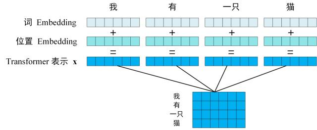
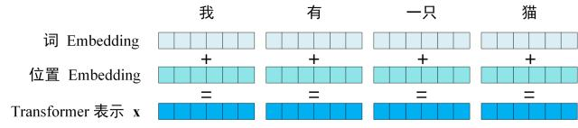
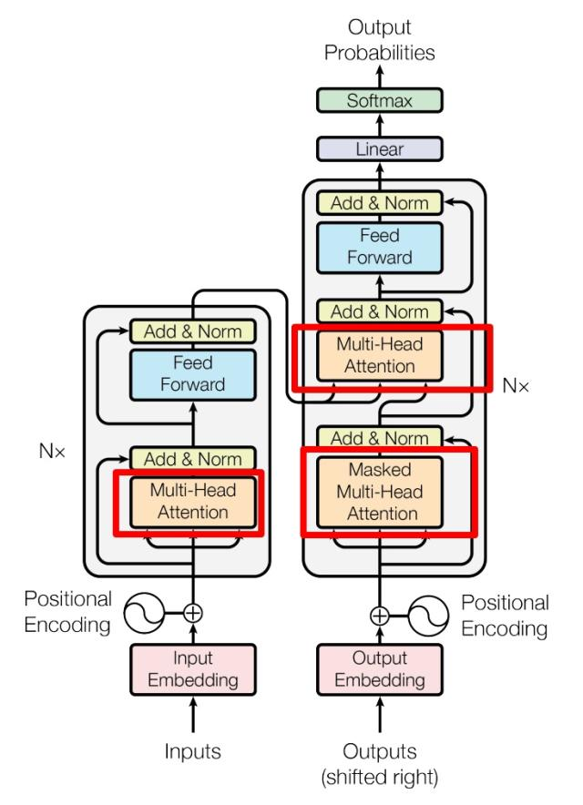
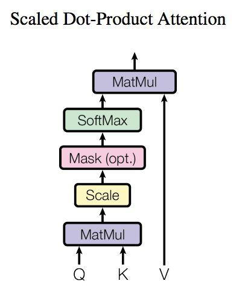
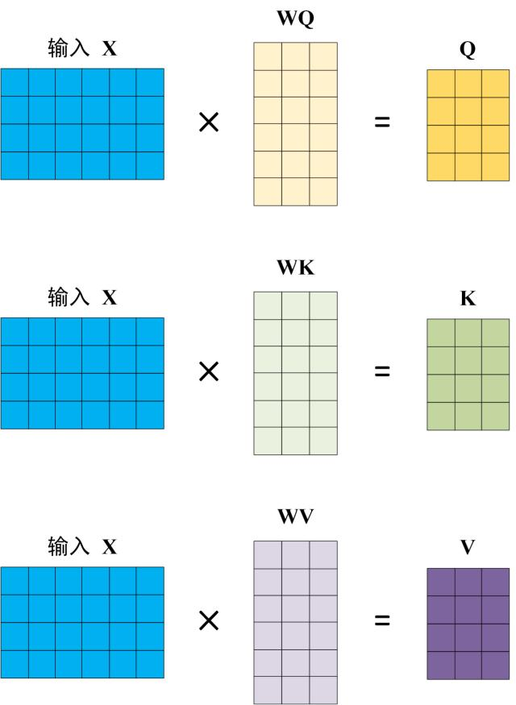
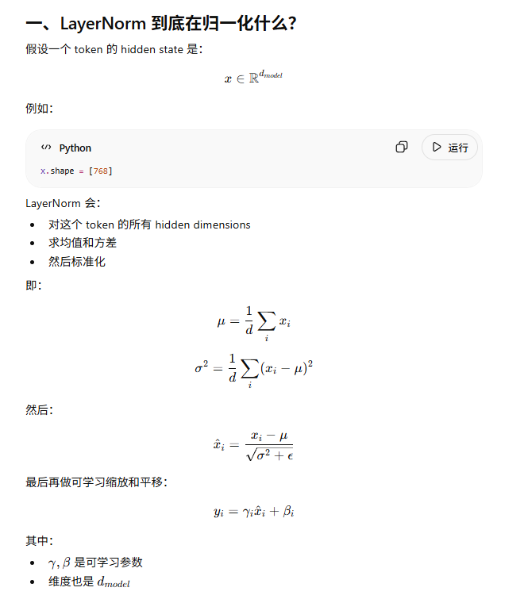

# Transformer 超级完整版

[TOC]

## 前言
Transformer架构，以及里面一些计算的方式我想一定会困惑我这样的普通学习者。但是，熟能生巧，看多了，多看几遍，其中的有意思的地方，也就慢慢清楚了。所以这里我既是笔记分享，也是对自己知识的梳理。我希望能通过这一篇文章，解决你对transformer的大多数问题。这里我们会参考https://zhuanlan.zhihu.com/p/338817680 里面的图片，并在此基础上，做一些补充。

## 架构
我们首先来看一下它的架构。

那首先呢，我们可以看到Transformer是由encoder和decoder组成的，对吧？然后呢，encoder和decoder具体有多少个block呢？我们这里是设置了6个block。

第一步：获取输入句子的每一个单词的表示向量 X，X由单词的 Embedding（Embedding就是从原始数据提取出来的Feature） 和单词位置的 Embedding 相加得到。

第二步：将得到的单词表示向量矩阵 (如上图所示，每一行是一个单词的表示 x) 传入 Encoder 中，经过 6 个 Encoder block 后可以得到句子所有单词的编码信息矩阵 C，如下图。单词向量矩阵用 $X_{n\times d}$ 表示， n 是句子中单词个数，d 是表示向量的维度 (论文中 d=512)。每一个 Encoder block 输出的矩阵维度与输入完全一致。

第三步：将 Encoder 输出的编码信息矩阵 C传递到 Decoder 中，Decoder 依次会根据当前翻译过的单词 1~ i 翻译下一个单词 i+1，如下图所示。在使用的过程中，翻译到单词 i+1 的时候需要通过 Mask (掩盖) 操作遮盖住 i+1 之后的单词。

上图 Decoder 接收了 Encoder 的编码矩阵 C，然后首先输入一个翻译开始符 "\<Begin>"，预测第一个单词 "I"；然后输入翻译开始符 "\<Begin>" 和单词 "I"，预测单词 "have"，以此类推。这是 Transformer 使用时候的大致流程，接下来是里面各个部分的细节。

## Transformer 的输入
Transformer的输入的话，我们会分为encoder部分和decoder部分输入。ok 继续

Transformer 中单词的输入表示 x由单词 Embedding 和位置 Embedding （Positional Encoding）相加得到。

### 词 Embedding

单词的 Embedding 有很多种方式可以获取，例如可以采用 Word2Vec、Glove 等算法预训练得到，也可以在 Transformer 中训练得到。
<!-- TODO: 这里我们会后续说如何获得 -->
### 位置 Position Embedding 
Transformer 中除了单词的 Embedding，还需要使用位置 Embedding 表示单词出现在句子中的位置。因为 Transformer 不采用 RNN 的结构，而是使用全局信息，不能利用单词的顺序信息，而这部分信息对于 NLP 来说非常重要。所以 Transformer 中使用位置 Embedding 保存单词在序列中的相对或绝对位置。

用 **PE** 表示，PE也是可以通过训练或者使用公式计算获得。Transformer中呢使用后者，下面就是：
\[
    PE_{(pos, 2i)} = sin(\frac{pos}{10000^{2i/d}})
\]

\[
    PE_{(pos, 2i+1)} = cos(\frac{pos}{10000^{2i/d}})
\]
其中，pos 表示单词在句子中的位置，d 表示 PE的维度 (与词 Embedding 一样)，2i 表示偶数的维度，2i+1 表示奇数维度 (即 2i≤d, 2i+1≤d)。使用这种公式计算 PE 有以下的好处：
* 使 PE 能够适应比训练集里面所有句子更长的句子，假设训练集里面最长的句子是有 20 个单词，突然来了一个长度为 21 的句子，则使用公式计算的方法可以计算出第 21 位的 Embedding。
* 可以让模型容易地计算出相对位置，对于固定长度的间距 k，PE(pos+k) 可以用 PE(pos) 计算得到。因为 Sin(A+B) = Sin(A)Cos(B) + Cos(A)Sin(B), Cos(A+B) = Cos(A)Cos(B) - Sin(A)Sin(B)。

将单词的词 Embedding 和位置 Embedding 相加，就可以得到单词的表示向量 x，x 就是 Transformer 的输入。

## Attention Mechanism 注意力机制
ok,我们来到了这张你看过无数次的transformer图上。

那我们会在这个图里看到multi head attention, 还有masked multi head attention, Multi-Head Attention, 上方还包括一个 Add & Norm 层，Add 表示残差连接 (Residual Connection) 用于防止网络退化，Norm 表示 Layer Normalization，用于对每一层的激活值进行归一化。那我们先从self attention开始讲，然后一个一个讲他们到底是什么.
### Self-Attention

上图呢，就是一个self attention的结构，在计算的时候呢，需要用到矩阵Q查询,K键值，还有V值。

### Q, K, V
Self-Attention 的输入用矩阵X进行表示，则可以使用线性变阵矩阵WQ,WK,WV计算得到Q,K,V。计算如下图所示，注意 X, Q, K, V 的每一行都表示一个单词。

### Self-Attention 的输出

\[Attention(Q,K,V) = softmax(\frac{QK^T}{\sqrt{d_k}})\times V\]
### Normalization / Residual / Linear / Softmax

#### Normalization 
LayerNorm 会：

对这个 token 的所有 hidden dimensions，求均值和方差，然后标准化。

**Why not batch?**
batch norm 是对“同一个 feature”跨 batch 统计，对于transformer来说，token 分布动态、变长、并行复杂，因此 BatchNorm 不稳定。

#### Linear
这里只指最后预测输出softmax之前的linear。
首先，softmax不会创造信息，只是把数字变成概率。

encoder/decoder block 中 数据的 size 一直是 d_model
最后需要一个linear 来映射到 vocabulary size

#### Softmax

## Decoder 结构

### 第二个MHA
Decoder block 第二个 Multi-Head Attention 变化不大， 主要的区别在于其中 Self-Attention 的 K, V矩阵不是使用 上一个 Decoder block 的输出计算的，而是使用 Encoder 的编码信息矩阵 C 计算的。

## KV Cache
要理解 KV Cache，必须先回到 Transformer 的自注意力机制。在自回归生成（autoregressive generation）过程中，模型每次只生成一个 token，然后将这个 token 拼接到已有序列后面，再生成下一个 token。这个过程看似简单，但隐藏着巨大的计算冗余。

标准的多头自注意力（Multi-Head Self-Attention）计算如下：
\[Attention(Q,K,V) = softmax(\frac{QK^T}{\sqrt{d_k}})\times V\]
# Decoder-only 详解
那像前面呢，我们已经讲过了，在Transformer的架构中，decoder的输入输出会是什么。现在呢，我们要讲一讲decoder only模型的具体的输入输出以及QKV是如何计算的。

一个decoder里只有一个masked MHA

## 参考
https://zhuanlan.zhihu.com/p/338817680