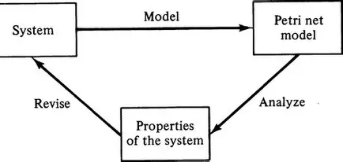

Image
 ↓
Preprocess
 ↓
Object Detection
 ↓
OCR
 ↓
Arrow Detection
 ↓
Topology Reconstruction
 ↓
Graph Builder
 ↓
PetriNet JSON

## 实例 Petri Net Image to Json
这里我们举一个具体的例子来说明，这也是我过去做的工作的一部分。
任务具体是将一张petri net image转换成 json格式。
目标格式是：
```json
{
  "places": [],
  "transitions": [],
  "arcs": []
}
```
这就形成了一个 Diagram Parsing System

解决方案是如何呢：
YOLOv8： 识别 transition， arcs， arrows， tokens
Label Studio 标注

PaddleOCR： 识别文字 -> 通过位置来确定属于哪个transition


OpenCV Topology Reconstruction
+
FastAPI

### Challenges
