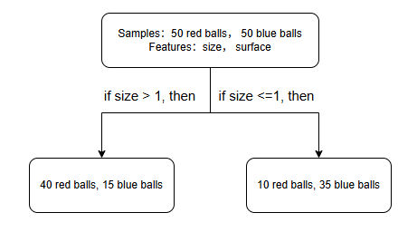
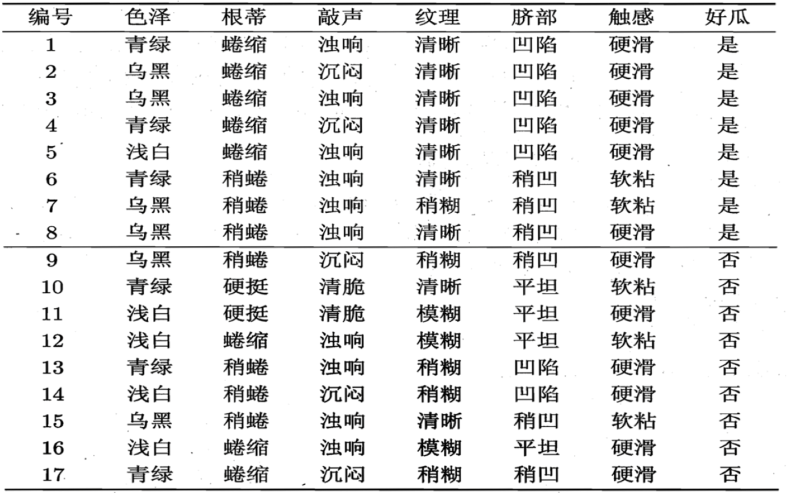
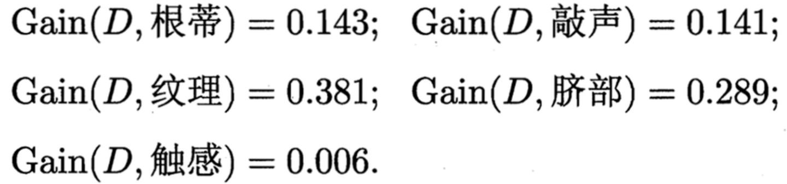
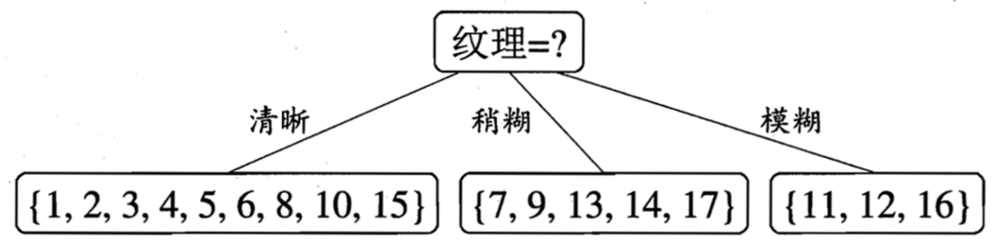
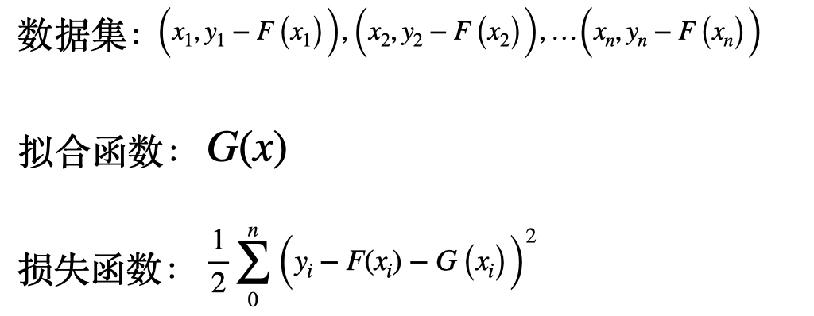
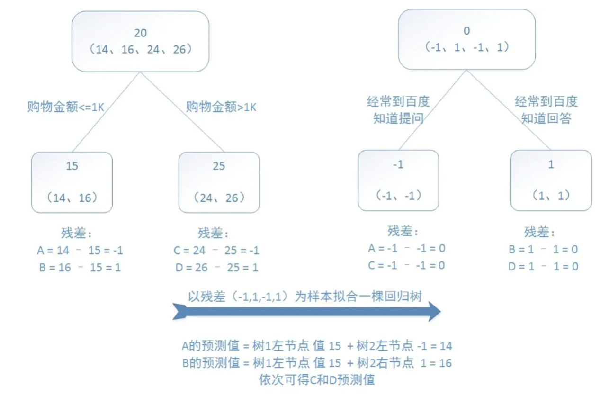
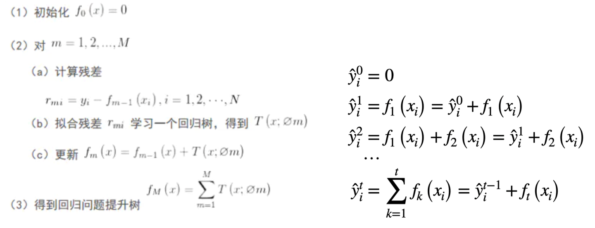
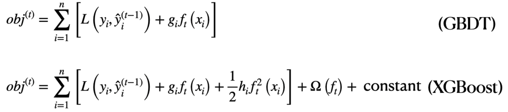

# 树模型

[TOC]

## 背景
树模型核心思想就是 “if.. else ..”, 复杂的树模型是很多棵决策书按照不同的方式组合。
这里我从基础开始一步步深入讲解，包含各种树模型的变式，顺便也是对自己知识的一个梳理。

## 决策树

决策树就是对某一个特征进行if else 判断，比如下面这个例子，是对球进行分类：假设现在是在一个漆黑的环境，我们看不到球的颜色，然后每个球呢，我们就不知道它的颜色，我们只靠触摸知道它的大小和表面surface,然后，现在呢，要依据这些特征进行颜色的推测和分类。那我们现在选择的是根据大小来进行分类，就是如果大小size>1的话，我们把它归为一类，如果size<1的话，我们把它归到另一类。然后，这样的结果呢，就像下面图中画的一样，嗯，就是不那么完美。

但是我们也可以看到啊，它这个球呢，也是大致上被分开的。那我们如何判断它到底是不是好或者坏呢？并且如何去选择这个对feature判断的那个阈值呢？就是Size是大于多少需要分为一类，或者小于多少被分为一类呢？那就是我们下面要讲的内容了

## 信息熵

信息熵在这里呢，就可被用来判断分类结果的好坏。这里的n累加是指总共有n种情况，然后每个情况的概率。
$H(X) = - \sum_{i=1}^{n} P(X=i) \log_2 P(X=i)$
下面这是一个抛硬币的例子，然后我们可以看到它是怎么来计算这个信息熵的，不确定越强，信息熵就越大，不确定性越弱，信息熵越小。

那现在有了这个信息熵做为一个指标之后，我们就可以去量化之前小球分类的结果了。 嗯，但是为了能够表述的准确，我们还需要用到条件熵和信息增益。

#### 条件熵 Conditional Entropy

条件熵定义是在给定随机变量 Y 的条件下，随机变量 X 的不确定性。
通俗理解：增加一个条件后，在该条件下的信息熵。可以类比为条件概率的概念。
$H(X|Y=y) = - \sum_{i=1}^{n} P(X=i|Y=y)\log_2 P(X=i|Y=y)$
#### 信息增益 Information Gain

信息增益用于衡量：在给定某个条件后，信息的不确定性减少了多少。
也可以理解为：加入一个条件后，信息熵下降的程度。
$I(X,Y) = H(X) - H(X|Y)$

#### 例子
使这三个概念来看这个例子。

首先 信息熵：$H(X) = - (0.5 \log_2 0.5 + 0.5 \log_2 0.5) = 1 $
然后 **条件熵**： 

##### 左子树：size > 1  
- 样本：40 红球, 15 蓝球  
- 总数：55

概率：

$
P(\text{红球} \mid \text{size}>1) = \frac{40}{55}, \quad P(\text{蓝球} \mid \text{size}>1) = \frac{15}{55}
$

条件熵公式：

$
H(X \mid \text{size}>1) = - \left( \frac{40}{55} \log_2 \frac{40}{55} + \frac{15}{55} \log_2 \frac{15}{55} \right)
$

计算结果约为：

$
H(X \mid \text{size}>1) \approx 0.86 \text{ bit}
$

##### 右子树：size ≤ 1  
- 样本：10 红球, 35 蓝球  
- 总数：45

概率：

$
P(\text{红球} \mid \text{size} \le 1) = \frac{10}{45}, \quad P(\text{蓝球} \mid \text{size} \le 1) = \frac{35}{45}
$

条件熵公式：

$
H(X \mid \text{size} \le 1) = - \left( \frac{10}{45} \log_2 \frac{10}{45} + \frac{35}{45} \log_2 \frac{35}{45} \right)
$

计算结果约为：

$
H(X \mid \text{size} \le 1) \approx 0.79
$

##### 给定特征 size 的条件熵 \(H(X \mid \text{size})\)

条件熵按权重加和：

$
H(X \mid \text{size}) = \frac{55}{100} \cdot 0.86 + \frac{45}{100} \cdot 0.79 \approx 0.83 \text{ bit}
$

##### 信息增益 \(I(X, \text{size})\)

$
I(X, \text{size}) = H(X) - H(X \mid \text{size}) = 1 - 0.83 \approx 0.17 
$
那像这样决策树就可以，通过信息增益作为判断依据，然后使用优化算法来带入各项特征去建立一个最优树。
然后树呢，也可以分为分类树和回归树。它们的区别就是叶子节点是具体的类别还是数值。

## ID3 算法
这里我们用西瓜书里的例子。根节点数据集中有8个好瓜和9个坏瓜，信息熵为0.998。

然后开始选择第一个特征，如何选择呢，就是分别使用不同的特征计算相应的信息增益。E.g., 第一个特征选色泽，计算出的信息增益为0.109，即Gain(D,色泽)=0.109。 同理， 当第一个特征选择别的特征时，信息增益如下：

**选择特征的逻辑是：选取最大信息增益的特征！**，因此，第一层会选择纹理作为其特征。

下一步是分别对每个子节点进行 **信息增益计算**， 例如，对纹理=清晰这一节点计算，然后选取最大信息增益。

以此类推，即可获得以下这棵树

#### 限制
该方法只适用于计算特征是离散的，比如触感是硬滑还是软粘这种特征，但不能处理比如0-1这样的连续特征值。并且用这种方式遍历构建决策树，会有过拟合问题。

## C4.5
为了缓解特征值数量问题对信息增益计算的影响，C4.5 使用信息增益率（Gain Ratio）替代信息增益（Information Gain）作为选择最优特征的标准。
$
\text{GainRatio}(D, A)=\frac{\text{Gain}(D, A)}
{
-\sum_{i=1}^{n}
\frac{|D_i|}{|D|}
\log_2
\left(
\frac{|D_i|}{|D|}
\right)
}
$

其中：

- \(D\)：当前数据集
- \(A\)：当前划分特征
- \(D_i\)：按照特征 \(A\) 划分后的第 \(i\) 个子集
- \(|D_i|\)：子集样本数量
- \(|D|\)：原始数据集样本数量
- \(\text{Gain}(D, A)\)：信息增益
针对ID3算法不能处理连续特征的问题，该算法使用二分法做离散化处理，先将连续特征从小到大排序，对N个连续数据进行N-1个二分划分，遍历N-1个划分点，分别计算这些子节点的信息增益，选择信息增益最大的二分结果作为该连续特征的最佳划分点。

#### 总结
总结一下，该方法使用信息增益率解决了ID3倾向于特征数量多的特征这一问题，并且实现了应用在连续特征中。并且可以使用剪枝来避免过拟合，剪枝由于是一个单独的知识体系，本文先不涉及。但是，可以看出，使用二分法对连续特征离散化的计算量很大。当连续特征数量比较多的时候，往往需要花费很长的时间去计算连续特征的信息增益率。并且，该算法没有考虑各个特征之间的相关性。

## CART3 算法
CART3算法针对分类数，引入了基尼不纯度（又称基尼指数）这一概念，这一概念表示样本集合中在一个随机选中的样本被分错的概率。该指数越小表示该集合的纯度越高，所有样本为同一类时，基尼指数为0。其中pk表示选中的样本属于第k个类别的概率。

$\text{Gini}(p)=\sum_{k=1}^{K} p_k (1-p_k)=1-\sum_{k=1}^{K} p_k^2$

数据集合 \(D\) 在特征 \(A\) 的条件下分成了 \(D1\) 和 \(D2\)，则集合 \(D\) 的基尼指数被定义为：

$\text{Gini}(D,A)
=\frac{|D_1|}{|D|}\text{Gini}(D_1)+\frac{|D_2|}{|D|}\text{Gini}(D_2)$

### CART3 回归树
CART3回归树，回归树的构建是用平方误差最小化准则进行特征选择，去生成二叉树。

\(\min_{c_1}\)意思就是：“不断调整 c1，让误差最小”
目标函数：

对于第 \(j\) 个特征，选择切分点 \(s\)，使划分后的平方误差最小：

$
\min_{j,s}
\left[
\min_{c_1}
\sum_{x_i \in R_1(j,s)}
(y_i-c_1)^2
+
\min_{c_2}
\sum_{x_i \in R_2(j,s)}
(y_i-c_2)^2
\right]
$

按照特征 \(j\) 和切分点 \(s\)，数据被划分为两个区域：

$
R_1(j,s)=\{x \mid x^{(j)} \le s\}
$

$
R_2(j,s)=\{x \mid x^{(j)} > s\}
$

其中：

- \(x^{(j)}\)：样本在第 \(j\) 个特征上的取值
- \(y_i\)：样本 label

**\(c_1\) 的含义**

表示：

> 左子区域 \(R_1\) 的预测值。

其计算方式为：

$
c_1=\frac{1}{N_1}\sum_{x_i\in R_1} y_i
$

即：

> 左区域所有 label 的平均值。

---

CART 回归树的思想：

> 每个区域用一个常数拟合。

而这个常数：

就是该区域 label 的均值。
### 总结

目前我们看到的树的方法，说到底，都是不断地尝试切分点 split point
# 优化方法 Ensemble Learning
## Boosting
讲到这个，就需要引入一个有意思的点，叫残差。
先考虑啊一个线性拟合

假如我们使用线性拟合已经得到了拟合函数，假如预测值F(x1)=0.8,F(x2)=0.9，而真值y1=1,y2=1.2，如何进一步提高拟合精度？

该集成方法的策略是使用残差作为数据集，使用新的拟合函数对残差进行拟合，得到另一个专门用于拟合残差的表达式。

这样，将F(x)和G(x)求和即是该模型的结果。

当前文提到的残差学习的思想应用于树模型，以下图为例。label是四个人的年龄，分别为14，16，24，26，特征是购物金额和在百度知道提问或回答。

则Boosting提升树的算法可以概括成如下。提升树模型是迭代多棵回归树共同决策，若使用L2范数为损失函数时，每一棵回归树学的都是之前所有树的结论和残差，拟合得到一个当前的残差回归树，残差的意义如公式：残差 = 真实值 - 预测值 。提升树即是整个迭代过程生成的回归树的累加。

### GBDT

GBDT的话，它就是像boosting的话会直接用它学的那个你和它的残差嘛。那GBDT的话是拟合的，它loss function的负导数而不是残差。

### XGBoost
前文的GBDT使用一阶导数信息，而XGBoost使用了二阶导数的信息，并为了防止模型结构过于复杂带来严重的过拟合现象，因此需要定义一个用于衡量模型复杂度的项。使得在取得较好效果的前提下，尽可能降低模型复杂度，从而防止过拟合现象

XGBoost：

eXtreme Gradient Boosting

在 GBDT 基础上：做了数学优化 + 工程优化。

--------------------------------------------------
1. XGBoost 的核心思想
--------------------------------------------------

XGBoost 本质上仍然是：Boosting + 决策树 + 梯度下降
模型形式：

$
F(x)=\sum_{m=1}^M h_m(x)
$

其中：

- $h_m(x)$：第 $m$ 棵树
- $F(x)$：最终模型

训练方式：逐步加树：

$
F_m(x)=F_{m-1}(x)+\eta h_m(x)
$

其中：

- $\eta$：学习率（Learning Rate）
- $h_m(x)$：当前新增树

--------------------------------------------------
2. XGBoost 和 GBDT 的核心区别
--------------------------------------------------

GBDT：

只使用：

一阶梯度（First-order Gradient）

即：

$
g_i=\frac{\partial L}{\partial F(x_i)}
$

XGBoost：

不仅使用一阶梯度：

还使用：

二阶梯度（Second-order Gradient / Hessian）

即：

$
h_i=\frac{\partial^2 L}{\partial F(x_i)^2}
$

因此：

XGBoost 比 GBDT：

- 更新更准确
- 收敛更快
- 优化更稳定

--------------------------------------------------
3. 为什么二阶导数重要
--------------------------------------------------

一阶导数：

告诉模型：

“往哪个方向下降最快”

二阶导数：

告诉模型：

“曲率有多大”

即：

当前位置：

- 陡不陡
- 弯不弯
- 能不能走快一点

因此：

GBDT：

更像：

“凭方向感下山”

XGBoost：

更像：

“看地形图下山”

--------------------------------------------------
4. XGBoost 的核心数学原理
--------------------------------------------------

XGBoost 使用：

二阶泰勒展开（Taylor Expansion）

对目标函数进行近似。

假设：

当前模型：

$
F_{m-1}(x)
$

新增树：

$
h_m(x)
$

更新：

$
F_m(x)=F_{m-1}(x)+h_m(x)
$

目标函数：

$
Obj=\sum_i L(y_i,F(x_i))+\Omega(h)
$

其中：

- $L$：损失函数
- $\Omega(h)$：正则化项

--------------------------------------------------
5. 二阶泰勒展开
--------------------------------------------------

XGBoost 对损失函数展开：

$
L(F+h)
\approx
L(F)
+
g h
+
\frac12 h^2 H
$

其中：

$
g=\frac{\partial L}{\partial F}
$

$
H=\frac{\partial^2 L}{\partial F^2}
$

因此：

XGBoost 同时考虑：

- 一阶梯度（方向）
- 二阶梯度（曲率）

--------------------------------------------------
6. 正则化（Regularization）
--------------------------------------------------

这是 XGBoost 极其重要的增强。

GBDT：

容易过拟合。

XGBoost：

增加：

正则化项：

$
\Omega(T)=\gamma T+
\frac12 \lambda \sum_j w_j^2$

其中：

- $T$：叶子数量
- $w_j$：叶子权重
- $\gamma$：叶子数量惩罚
- $\lambda$：L2 正则化系数

因此：

复杂树：

会被惩罚。

--------------------------------------------------
7. XGBoost 的目标函数
--------------------------------------------------

最终目标：

$Obj=\sum_i L(y_i,\hat y_i)
+
\Omega(T)
$

即：

总目标：=损失+模型复杂度惩罚

作用：
- 防止过拟合
- 提高泛化能力
- 让树更简单

--------------------------------------------------
8. XGBoost 如何生成新树
--------------------------------------------------

Step1：

当前模型：

$
F_{m-1}(x)
$

Step2：

计算每个样本：

一阶梯度：

$g_i=\frac{\partial L}{\partial F(x_i)}$

二阶梯度：

$h_i=\frac{\partial^2 L}{\partial F(x_i)^2}$

Step3：

训练新树：

$
h_m(x)
$

使目标函数下降最快。

Step4：

更新：

$F_m(x)=F_{m-1}(x)+\eta h_m(x)$

--------------------------------------------------
9. 学习率（Learning Rate）
--------------------------------------------------

更新：

$F_m(x)=F_{m-1}(x)+\eta h_m(x)$

其中：

$
\eta
$

控制：

“每棵树影响最终模型的程度”

如果：

- $\eta$ 太大：
  - 容易过拟合
  - 更新太猛

- $\eta$ 太小：
  - 收敛慢
  - 需要更多树

通常：

小学习率 + 多树
效果更好。

--------------------------------------------------
10. XGBoost 的工程优化
--------------------------------------------------

XGBoost 真正爆火：

不仅因为数学。

更因为：

工业级工程实现。

包括：

1. 并行计算
2. Cache 优化
3. 稀疏优化
4. 缺失值自动处理
5. Histogram 分裂优化
6. Feature Sampling
7. 外存计算

因此：

XGBoost：

- 快
- 稳
- 可扩展
- 能处理大规模数据

--------------------------------------------------
11. XGBoost 的本质
--------------------------------------------------

XGBoost 本质：

“带正则化的二阶梯度提升树”

即：

- Boosting
- 决策树
- 梯度下降
- 二阶优化
- 正则化

的结合。

--------------------------------------------------
12. XGBoost 和 GBDT 的最终区别
--------------------------------------------------

GBDT：

只使用：

$
\frac{\partial L}{\partial F}
$

即：

一阶梯度。

--------------------------------------------------

XGBoost：

同时使用：

$
\frac{\partial L}{\partial F}
$

和：

$
\frac{\partial^2 L}{\partial F^2}
$

即：

一阶 + 二阶优化。

并加入：

- 正则化
- 工程优化
- 特征采样
- 高性能实现

--------------------------------------------------
13. 一句话总结
--------------------------------------------------

XGBoost：

本质上仍然是 GBDT。

但它：

通过：

- 二阶泰勒展开
- Hessian 信息
- 正则化
- 工程优化

把 GBDT 提升成了：

工业级高性能 Boosting 算法。
### Boosting 其他变种

## Bagging
Bagging 的全称是：

**Bootstrap Aggregating**
Bagging 和 Boosting 是机器学习里两种完全不同的集成学习思路。它们都想解决“单个模型不够强”的问题，但解决方式几乎相反。

Bagging 的想法其实很朴素：

“既然一个模型不稳定，那我就训练很多个模型，然后取平均。”

而 Boosting 的想法是：

“前面的模型哪里做错了，后面的模型就专门去修这个错误。”

这两个思想，后来分别发展出了：

Bagging → Random Forest（随机森林）
Boosting → GBDT、XGBoost、LightGBM

这是两条完全不同的技术路线。

它是一种经典的集成学习（Ensemble Learning）方法。

Bagging 的核心思想是：

> 训练多个彼此独立的模型，然后对结果进行平均（回归）或投票（分类）。

它的目标主要是：

- 降低模型方差（Variance）
- 提高模型稳定性
- 减少过拟合风险

---

### Bagging 的基本流程

Bagging 的训练流程通常如下：

#### 1. Bootstrap Sampling（自助采样）

从原始训练集里：

随机有放回地抽样。

生成多个不同的数据子集。

例如：

- Dataset 1
- Dataset 2
- Dataset 3

每个子集大小通常与原始数据集相同。

---

#### 2. 独立训练多个模型

每个数据子集：

各自训练一个模型。

这些模型之间：

- 相互独立
- 没有前后依赖关系

因此：

Bagging 可以并行训练。

---

#### 3. 聚合结果（Aggregating）

对于回归问题：

通常取平均值：

$
F(x)=\frac1M\sum_{m=1}^M h_m(x)
$

对于分类问题：

通常使用多数投票。

---

#### Bagging 的核心理念

Bagging 的核心理念可以概括为：

> “多个容易波动的模型，平均后会变得稳定。”

它尤其适合：

高方差模型（High Variance Models）。

例如：

- 决策树

因为单棵决策树：

对训练数据非常敏感。

数据稍微变化：

树结构就可能完全不同。

Bagging 通过：

训练大量不同的树并平均结果，

来降低这种不稳定性。

---

#### Bagging 的典型算法
Random Forest（随机森林）

最经典的 Bagging 算法。

核心：

- Bootstrap Sampling
- 多棵决策树
- 随机特征采样
- 最终投票/平均

## Stacking/ Blending

Stacking（堆叠集成）和 Blending（融合）：

都是集成学习（Ensemble Learning）中的高级集成方法。

它们的核心思想不是：

- 平均结果（Bagging）
- 修复错误（Boosting）

而是：

> “再训练一个模型，专门学习如何组合多个模型的输出。”

因此：

它们本质上属于：

**模型融合（Model Fusion / Meta Learning）**

---

### 为什么需要 Stacking

假设：

你有多个模型：

- Random Forest
- XGBoost
- LightGBM
- Logistic Regression

这些模型：

各自擅长不同情况。

例如：

- XGBoost 擅长复杂非线性
- Logistic Regression 擅长线性关系
- Random Forest 更稳定

于是：

问题变成：

> “能不能让另一个模型自动学习：
> 在什么情况下更相信哪个模型？”

这就是：

Stacking 的核心思想。

---

### Stacking 的核心结构

#### 第一层（Base Models）

多个基础模型：

例如：

- Random Forest
- XGBoost
- SVM
- Neural Network

这些模型：

各自训练。

并输出预测结果。

---

#### 第二层（Meta Model）

再训练一个模型：

专门学习：

如何组合第一层模型的输出。

这个模型叫：

- Meta Learner
- Level-2 Model

---

### Stacking 的训练流程

假设：

原始数据：

$
(X, y)
$

#### Step1：训练第一层模型

例如：

- RF
- XGB
- SVM

得到预测：

$
\hat y_1,\hat y_2,\hat y_3
$

---

#### Step2：构造新的训练集

把：

第一层模型输出：

作为新特征。

例如：

| RF输出 | XGB输出 | SVM输出 | 真实标签 |
|---|---|---|---|
| 0.8 | 0.9 | 0.7 | 1 |
| 0.2 | 0.3 | 0.1 | 0 |

---

#### Step3：训练第二层模型

训练：

Meta Model：

$
g(\hat y_1,\hat y_2,\hat y_3)
$

学习：

“如何组合这些模型”。

---

#### Step4：最终预测

最终结果：

$
F(x)=g(h_1(x),h_2(x),...,h_m(x))
$

其中：

- $h_i(x)$：基础模型
- $g$：融合模型

---

### Stacking 的本质

Stacking 本质：

不是简单平均。

而是：

> “学习不同模型之间的组合关系。”

它是一种：

“模型上的机器学习”。

---

### 为什么 Stacking 有效

因为：

不同模型：

犯错方式不同。

例如：

- 模型A：容易高召回
- 模型B：容易高精度
- 模型C：对异常值稳定

Meta Model：

会自动学习：

- 什么时候相信A
- 什么时候相信B
- 什么时候忽略C

因此：

效果常常优于单模型。

---

### Stacking 最大问题：数据泄漏

如果：

第一层模型：

直接在训练集预测，

再拿这些预测训练第二层模型。

会发生：

严重过拟合。

因为：

Meta Model：

看到了“训练答案”。

---

#### 解决方法：K-Fold Out-of-Fold Prediction

流程：

##### Fold1

用 Fold2~5 训练。

预测 Fold1。

---

##### Fold2

用 Fold1、3、4、5 训练。

预测 Fold2。

---

最终：

得到：

整个训练集上的：

“非泄漏预测”。

然后：

再训练第二层模型。

---

### Blending 是什么

Blending：

可以理解成：

> “简化版的 Stacking”

它也有：

- 第一层模型
- 第二层模型

但：

不使用 K-Fold。

---

### Blending 的流程

假设：

训练集：

分成：

- Train Set
- Validation Set

#### Step1

基础模型：

只在 Train Set 上训练。

---

#### Step2

基础模型：

预测 Validation Set。

得到：

- RF预测
- XGB预测
- SVM预测

---

#### Step3

用这些预测：

训练 Meta Model。

---

#### Step4

最终：

融合预测。

---

### Blending 和 Stacking 的区别

Blending：

不做 K-Fold。

而是：

直接留出 Validation Set。

因此：

Blending：

更简单。

但：

会浪费一部分训练数据。

---

### 为什么 Blending 更容易实现

因为：

不用：

K-Fold Out-of-Fold。

实现简单很多。

因此：

工程里：

很多人会先做 Blending。

---

### Stacking vs Blending

| 对比 | Stacking | Blending |
|---|---|---|
| 是否使用 K-Fold | 是 | 否 |
| 是否容易数据泄漏 | 较低 | 较高 |
| 数据利用率 | 高 | 较低 |
| 实现复杂度 | 高 | 低 |
| 泛化能力 | 更强 | 略弱 |
| 工程实现 | 较复杂 | 简单 |

---

### 和 Bagging / Boosting 的区别

#### Bagging

多个模型：

独立训练。

最后：

平均结果。

---

#### Boosting

后模型：

修复前模型错误。

---

#### Stacking

再训练一个模型：

学习：

“如何组合多个模型”。

---

### 四种集成方法最终对比

| 方法 | 核心思想 |
|---|---|
| Bagging | 独立训练后平均 |
| Boosting | 后模型修复前模型 |
| Stacking | 学习如何组合多个模型 |
| Blending | 简化版 Stacking |

---

### 典型应用场景

Stacking：

非常常见于：

- Kaggle比赛
- 高精度任务
- 多模型融合

因为：

它通常能：

进一步榨出性能。

---

### 一句话总结

#### Bagging

“大家独立学习，然后平均。”

---

#### Boosting

“后面的模型修复前面的错误。”

---

#### Stacking

“训练一个新模型，学习如何组合已有模型。”

---

#### Blending

“简化版 Stacking，用验证集做融合。”

### 参考文献：
https://zhuanlan.zhihu.com/p/399549773
